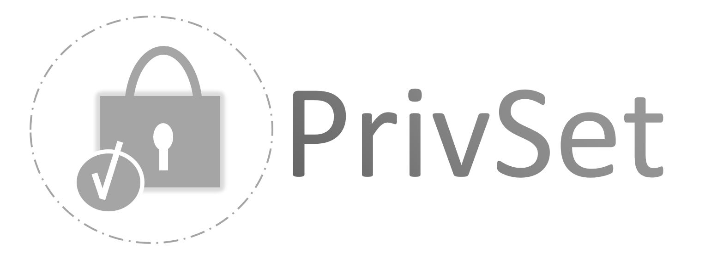

**PROTOTYPE** Currently, this extension is still in the early stage of a prototype.

# PrivSet: A browser extension that intuitively increases your privacy on Facebook

## What is PrivSet?

PrivSet is a browser extension for Mozilla Firefox and Google Chrome, which adapts the user interface of Facebook.
The goal is to provide a more intuitive and interactive way for users to set their privacy settings according to their needs.
An additional benefit is the fact the users increase their privacy awareness.

## How to install PrivSet?

First download the code. If you downloaded it as a zip file, then you have to extract it. The next steps depend on your browser:

### Mozilla Firefox

1. Open your browser.
2. Navigate to [about:debugging#addons](about:debugging#addons).
3. Click on the *Load Temporary Add-on*.
4. Select the file *manifest.json* inside the folder containing the downloaded code.

### Google Chrome

1. Open your browser.
2. Navigate to [chrome://extensions](chrome://extensions).
3. Activate the *developer mode*, if it isn't on yet.
4. Click on the *Load Temporary Add-on*.
5. Select the folder containing the downloaded code.

## Where was PrivSet created and by whom?

PrivSet was created at the University of Fribourg in Switzerland.
It was a project during the Seminar "Web Analysis and Monitoring" by the students Astrid  Bagué  and  Guillaume  Corsini.

## What can PrivSec do?

Four scenarios have been defined, where the extension tries to provide a more intuitive user interface.

### The drunk

A  young  adult  user  still  in  love  with  his  ex,  wants  to    post    something  while  being  drunk.  The  text  contains  random    gibberish,  multiple  times  the  word    ‘  drunk  ’  or  some  awkward  text  like    ‘  I    still  love  my    ex  ’  .  He  is  about  to  make  the  post  public,  but  in  a  sober    condition  he  would  never  share  this  at  all.  The  develo  ped  prototype  in  this  paper  recognizes  that    the  young  adult  entered  the  keyword    ‘  drunk  ’    multiple  times  and  will  then  post  the  content  restricting    the  audience  to  only  him .    Hence,  the  user  will  have  to  actively  change  the  audi ence  of  the  post.   
 
 
### The rad
 
A  politically  radical  user  wants  to  join  a  radical  group  by  being    recognized.  He  wants  thus  to  share  radical  content  with    only  other  radical  people  with  the  identical    ideology  and  not  with  all  his  friends.  The  designed  prototype  will  display  all  the  friend  lists  available    (including  pictures  of  its  members)  instead  of  the  Facebook  dropdown.  When  posting  hyperlinks considered  radical,  the  prototype  will  check  the  selected  audience  and  only  accept  posting  it  to non-standard  lists.   
 
 
### The heartbroken

The  user  is  heartbroken  because  of  a  recent  break-up.    Things  didn  ’  t  end  well  between  the  lovers,  so  actually  the  user  doesn  ’  t  want  his  ex  to  see  his  future    posts.  From  now  on,  the  heartbroken  only  wants  to  share  content  with  all  his  friends  except  the  ex.    When  the  user  changes  his  relationship  status  on  Facebook  to  ‘  single  ’  ,  the  prototype  will  provide  a    checkbox  to  exclude  the  ex  from  seeing  future  posts.  
 
 
### The gamer
 
Parents  often  give  their  phones  to  their  kids  to  play    a    Facebook  game  or  a  game  for  which  Facebook  is  used  to  log    in.  By  using  Facebook  these  apps    can  then  request  personal  information,  show  to  other  users  of  the  network  that  the  parent  uses  the    app  and  can  also  post  something  on  their  behalf  if  the    settings  are  not  adapted.  The  parent  of  the    gamer  doesn  ’  t  want  it  to  be  visible  to  anyone  that  his  kid  uses  the    app.  Therefore  in  the  prototype,    the  user  will  be  forwarded  to  the  apps  ’    settings  after  installing  a  new  app.
